<div align="center">

<h3><code>diwakar@github ~ $ ./contributions.sh</code></h3>



<br><br>

<h3><code>diwakar@github ~ $ whoami</code></h3>

<table>
<tr>
<td valign="top">

</td>
<td valign="top">

</td>
</tr>
</table>

<br>

<h3><code>diwakar@github ~ $ ./links.sh</code></h3>

<p>
  <a href="https://github.com/diwakarreddy706-maker"></a>
  &nbsp;
  <a href="mailto:diwakarreddy706@gmail.com"></a>
  &nbsp;
  <a href="https://github.com/diwakarreddy706-maker"></a>
</p>

<br>

---

### 🚀 About Me

```developer
  Python & AI Engineer specializing in voice assistants, automated systems,
  financial management suites, and interactive data visualizers.
```

<b>Python Development</b> &bull; <b>AI & Automation</b> &bull; <b>Full-Stack Web Systems</b>

<br>

#### 🛠️ Tech Stack & Tools

`Python` &bull; `Django` &bull; `MySQL` &bull; `JavaScript` &bull; `HTML5/CSS3` &bull; `Git` &bull; `SVG`

<br>

#### 🌟 Featured GitHub Repositories

| Repository | Description | Primary Tech | Link |
| :--- | :--- | :--- | :--- |
| **Denver-AI** | Local-first Voice & Desktop AI Assistant for Windows with WhatsApp automation & multi-model LLM routing | Python, AI | [View Repo](https://github.com/diwakarreddy706-maker/Denver-AI) |
| **expense-tracking-system** | Enterprise Expense & Management System with Django, MySQL, financial ledger & analytics | Python, Django, MySQL | [View Repo](https://github.com/diwakarreddy706-maker/expense-tracking-system) |
| **diwakarreddy706-maker** | Terminal-Inspired Animated GitHub Profile README with Heatmap, ASCII Portrait & Info Card | Python, SVG, GitHub Actions | [View Repo](https://github.com/diwakarreddy706-maker/diwakarreddy706-maker) |

<br>

</div>

